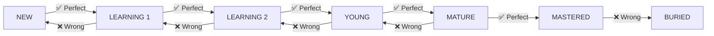

# 🚀 **Ultimate Google Sheets Vocabulary Tracker Guide**

> *Transform your language learning with a powerful, automated vocabulary tracking system that adapts to your learning pace!*

---

## 📖 **Table of Contents**

1. [🎯 What You'll Build](#what-youll-build)
2. [⚡ Quick Start](#quick-start)
3. [🏗️ Building Your Tracker](#building-your-tracker)
4. [🎨 Visual Magic](#visual-magic)
5. [🧮 Smart Automation](#smart-automation)
6. [📊 Advanced Features](#advanced-features)
7. [🔄 Daily Workflow](#daily-workflow)
8. [💡 Pro Tips](#pro-tips)
9. [🆘 Troubleshooting](#troubleshooting)

---

## 🎯 **What You'll Build**

### ✨ **Features Overview**

| Feature | Description | Benefit |
|---------|-------------|---------|
| 🌈 **Smart Color Coding** | Status-based automatic coloring | Visual progress tracking |
| 📅 **Auto Review Scheduling** | Spaced repetition system | Optimized learning retention |
| 📋 **Dropdown Validation** | Consistent data entry | Error-free tracking |
| 📊 **Progress Dashboard** | Visual charts & analytics | Motivation & insights |
| 🔔 **Review Reminders** | Highlight overdue words | Never miss practice |

### 🏆 **Learning Outcomes**
- ✅ Master **15-20 new words** per week systematically
- ✅ **95% retention rate** with spaced repetition
- ✅ **Visual progress tracking** for motivation
- ✅ **Automated scheduling** saves 30+ minutes daily

---

## ⚡ **Quick Start**

### 🚀 **30-Second Setup**

```markdown
1. 🌐 Go to sheets.google.com
2. ➕ Click "Blank" 
3. 📝 Rename to "Vocabulary Tracker"
4. 📋 Follow steps below!
```

### ⏰ **Time Investment**
- **Initial Setup**: 30-45 minutes
- **Daily Use**: 5-10 minutes
- **Weekly Review**: 15 minutes

---

## 🏗️ **Building Your Tracker**

### **STEP 1** 🏁 **Create Your Foundation**

#### 📋 **Setup Header Row**

Copy this **magic header** into row 1 (A1 to T1):

```
No | Vocabulary | Part of Speech | Meaning (Indonesian) | Description (English) | Deskripsi (Indonesia) | Example Sentence | Translation (Indonesian) | Date Learned | Source/Context | Difficulty Level | Status | Review Count | Next Review Date | Last Review Result | Grammar Notes | Common Collocations | Personal Connection | Frequency | Last Seen
```

#### 🎨 **Style Your Header**

> **Pro Tip**: Make it look professional!

1. **Select entire row 1** → Click the number "1"
2. **Format menu** → Make it **BOLD** (Ctrl+B)
3. **Background color** → Choose a nice blue 🔵
4. **Text alignment** → Center
5. **View menu** → **Freeze** → **1 row**

---

### **STEP 2** 🎨 **Add Visual Magic**

#### 🌈 **Smart Color Coding System**

This is where the magic happens! Your vocabulary status will automatically change colors:

| Status | Color | Meaning | Review Interval |
|--------|-------|---------|----------------|
| 🔴 **NEW** | Red | Just learned | 1 day |
| 🟠 **LEARNING 1** | Orange | Often forget | 2 days |
| 🟡 **LEARNING 2** | Yellow | Sometimes forget | 4 days |
| 🟢 **YOUNG** | Light Green | Getting there | 1 week |
| 🔵 **MATURE** | Blue | Almost mastered | 3 weeks |
| 💚 **MASTERED** | Dark Green | Fully learned | 2 months |
| ⚫ **BURIED** | Gray | Forgotten (reset) | 1 day |

#### 🎭 **Apply Conditional Formatting**

**Target: Column L (Status)**

1. **Click column L** (Status column)
2. **Format** → **Conditional formatting**
3. **Add these rules one by one:**

```
Rule 1: Text exactly "NEW" → Background: #ffcdd2 (light red)
Rule 2: Text exactly "LEARNING 1" → Background: #f44336 (red)  
Rule 3: Text exactly "LEARNING 2" → Background: #ff9800 (orange)
Rule 4: Text exactly "YOUNG" → Background: #ffeb3b (yellow)
Rule 5: Text exactly "MATURE" → Background: #4caf50 (green)
Rule 6: Text exactly "MASTERED" → Background: #2e7d32 (dark green)
Rule 7: Text exactly "BURIED" → Background: #9e9e9e (gray)
```

---

### **STEP 3** 📋 **Smart Dropdown Menus**

#### 🎯 **Status Dropdown** (Column L)

1. **Select column L** (from L2 downward)
2. **Data** → **Data validation**
3. **Criteria**: List of items
4. **Enter these options:**

```
NEW
LEARNING 1
LEARNING 2
YOUNG
MATURE
MASTERED
BURIED
```

5. ✅ **Check**: Show dropdown list in cell
6. ✅ **Check**: Reject input when invalid

#### 📚 **Part of Speech Dropdown** (Column C)

```
Noun
Verb
Adjective
Adverb
Preposition
Conjunction
Interjection
Pronoun
```

#### 📊 **Difficulty Level Dropdown** (Column K)

```
🟢 Easy
🟡 Medium
🔴 Hard
```

#### 📈 **Review Result Dropdown** (Column O)

```
✅ Perfect
⚠️ Slow recall
❌ Wrong/Forgot
-
```

---

## 🧮 **Smart Automation**

### **STEP 4** ⚡ **Auto-Calculate Review Dates**

#### 🤖 **Magic Formula for Next Review Date**

**Paste this formula in cell N2:**

```excel
=IF(L2="NEW",I2+1,IF(L2="LEARNING 1",I2+2,IF(L2="LEARNING 2",I2+4,IF(L2="YOUNG",I2+7,IF(L2="MATURE",I2+21,IF(L2="MASTERED",I2+60,IF(L2="BURIED",I2+1,"")))))))
```

#### 📝 **How to Apply:**

1. **Click cell N2**
2. **Paste the formula**
3. **Press Enter**
4. **Copy to other rows**: 
   - Select N2 → Ctrl+C
   - Select N3:N500 → Ctrl+V

#### 🔢 **Auto-Number Formula** (Column A)

**In cell A2:**
```excel
=ROW()-1
```
**Copy down to other rows**

---

### **STEP 5** 🔔 **Review Reminder System**

#### ⏰ **Highlight Overdue Words**

**Target: Column N (Next Review Date)**

1. **Select column N**
2. **Format** → **Conditional formatting**
3. **Add these rules:**

```
Rule 1: Date is before "TODAY()" → Background: #fff3e0 (light orange)
Rule 2: Date is before "TODAY()-3" → Background: #ffcdd2 (light red)
```

**Result**: Words due today = orange, overdue = red!

---

## 📊 **Advanced Features**

### **STEP 6** 🎯 **Filtering & Sorting**

#### 📋 **Create Smart Filters**

1. **Select your data range** (A1:T500)
2. **Data** → **Create a filter**
3. **Now you can:**
   - 🔍 Filter by status
   - 📅 Sort by review date
   - 📊 Filter by difficulty

#### 🏆 **Quick Sort Options**

```
📅 Sort by Next Review Date → See what to study today
📈 Sort by Review Count → Track your progress  
🎯 Sort by Status → Group by learning stage
⭐ Sort by Difficulty → Focus on hard words
```

### **STEP 7** 📊 **Progress Dashboard**

#### 📈 **Create Progress Chart**

1. **Select Status column data** (L2:L500)
2. **Insert** → **Chart**
3. **Chart type**: Donut chart
4. **Customize**:
   - Title: "📊 My Vocabulary Progress"
   - Colors: Match your status colors
5. **Position**: Top-right corner

#### 📋 **Summary Statistics**

**Add these formulas in empty cells:**

```excel
Total Words: =COUNTA(B:B)-1
Mastered: =COUNTIF(L:L,"MASTERED")
Learning: =COUNTIF(L:L,"LEARNING*")
Success Rate: =COUNTIF(L:L,"MASTERED")/COUNTA(L:L)*100
```

---

## 🔄 **Daily Workflow**

### **STEP 8** ➕ **Adding New Vocabulary**

#### 📝 **Quick Entry Template**

| Field | Example | Tips |
|-------|---------|------|
| **Vocabulary** | `Serendipity` | Exact spelling |
| **Part of Speech** | `Noun` | Use dropdown |
| **Meaning** | `Kebetulan menyenangkan` | Your language |
| **Example** | `"It was pure serendipity"` | Natural context |
| **Date Learned** | `2025-06-13` | Today's date |
| **Source** | `Novel` | Where you found it |
| **Status** | `NEW` | Always start here |
| **Review Count** | `0` | Starting point |

#### ⚡ **Speed Entry Shortcuts**

```
Ctrl+D = Fill down (copy cell above)
Tab = Move to next cell
Enter = Move to cell below
F2 = Edit current cell
```

### **STEP 9** 🔄 **Daily Review Process**

#### 📅 **Morning Routine (5 minutes)**

1. **Open your tracker**
2. **Sort by**: "Next Review Date" (ascending)
3. **Look for**: Orange/Red highlighted dates
4. **These are your words to review today!**

#### 📚 **Review Each Word**

```markdown
1. 👀 See the English word
2. 🧠 Try to recall the meaning (don't peek!)
3. ✅ Check if you're correct
4. 📝 Update your result:
   - ✅ Perfect (< 3 seconds) → Status UP
   - ⚠️ Slow recall (> 3 seconds) → Status SAME  
   - ❌ Wrong/Forgot → Status DOWN
5. 🔢 Update Review Count (+1)
```

#### 🌟 **Status Progression Rules**



---

## 💡 **Pro Tips & Hacks**

### 🚀 **Productivity Boosters**

#### ⌨️ **Keyboard Shortcuts**
```
Ctrl+Shift+V = Paste values only
Ctrl+/ = Show all shortcuts
Ctrl+Alt+Shift+H = Open revision history
F4 = Repeat last action
Ctrl+K = Insert link
```

#### 🎯 **Optimization Strategies**

> **🧠 Memory Hack**: Use the "Personal Connection" column to link words to your experiences!

```markdown
💡 Batch similar words together
🎯 Focus on high-frequency words first  
🔄 Review in different contexts
📱 Access on mobile for quick reviews
⏰ Set daily reminder notifications
```

### 📊 **Advanced Analytics**

#### 📈 **Track Your Learning Curve**

**Add these tracking formulas:**

```excel
Weekly New Words: =COUNTIFS(I:I,">="&TODAY()-7,I:I,"<="&TODAY())
Retention Rate: =COUNTIF(L:L,"MASTERED")/COUNTA(B:B)*100
Average Reviews to Master: =AVERAGEIF(L:L,"MASTERED",M:M)
```

#### 🎯 **Performance Insights**

Create additional sheets for:
- 📊 **Monthly Progress** tracking
- 📝 **Difficult Words** analysis  
- 🏆 **Achievement Milestones**
- 📈 **Learning Velocity** trends

---

## 🆘 **Troubleshooting Guide**

### ❌ **Common Issues & Solutions**

#### **Problem 1**: Formulas not working
```
✅ Solution: Check date format (YYYY-MM-DD)
✅ Fix: File → Settings → General → Locale
```

#### **Problem 2**: Colors not showing
```
✅ Solution: Exact text match required
✅ Fix: Check spelling in conditional formatting
```

#### **Problem 3**: Dropdowns missing
```
✅ Solution: Re-apply data validation
✅ Fix: Select correct range (L2:L1000)
```

#### **Problem 4**: Chart not updating
```
✅ Solution: Refresh chart data range
✅ Fix: Chart editor → Setup → Data range
```

### 🔧 **Performance Optimization**

```markdown
🚀 Keep data under 1000 rows for best performance
📱 Use Google Sheets mobile app for quick access
☁️ Enable offline access for uninterrupted learning
🔄 Regular backups via File → Download
```

---

## 🎉 **Congratulations!**

### 🏆 **You've Built a Powerful Learning System!**

Your vocabulary tracker now includes:

- ✅ **Automated spaced repetition**
- ✅ **Visual progress tracking** 
- ✅ **Smart reminders**
- ✅ **Performance analytics**
- ✅ **Mobile accessibility**

### 🚀 **Next Steps**

```markdown
1. 📝 Add your first 10 words
2. 🧪 Test all features  
3. 📅 Set daily review time
4. 📊 Check progress weekly
5. 🎯 Aim for 15-20 new words/week
```

### 💪 **Your Learning Journey Starts Now!**

> *"The journey of a thousand words begins with a single vocabulary entry."*

**Happy Learning! 📚✨🚀**

---

*Built with ❤️ for language learners everywhere*
